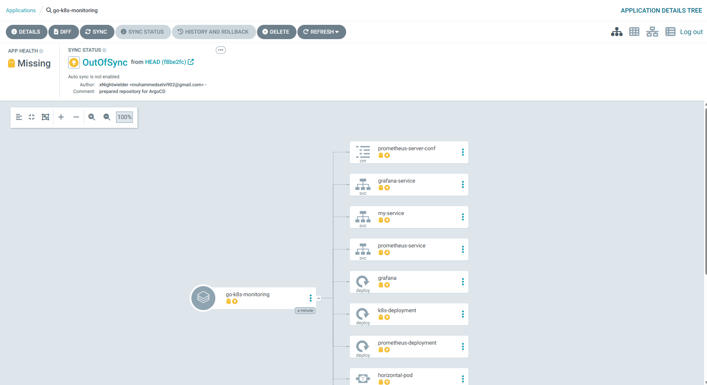
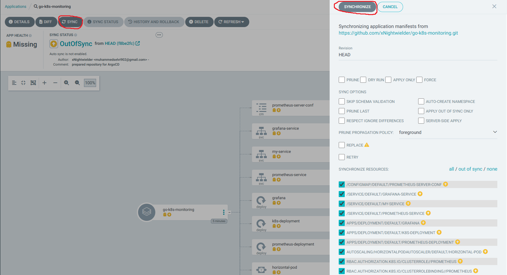
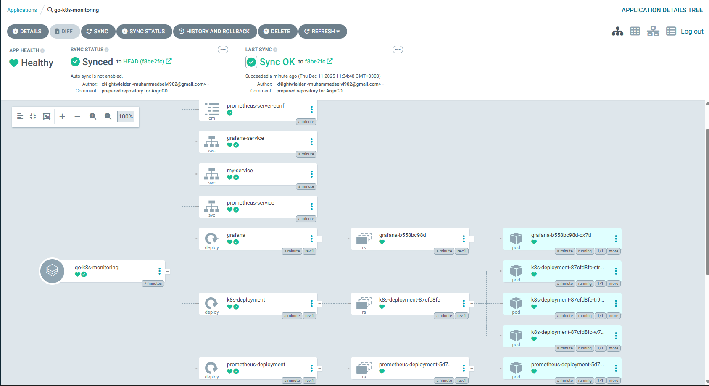
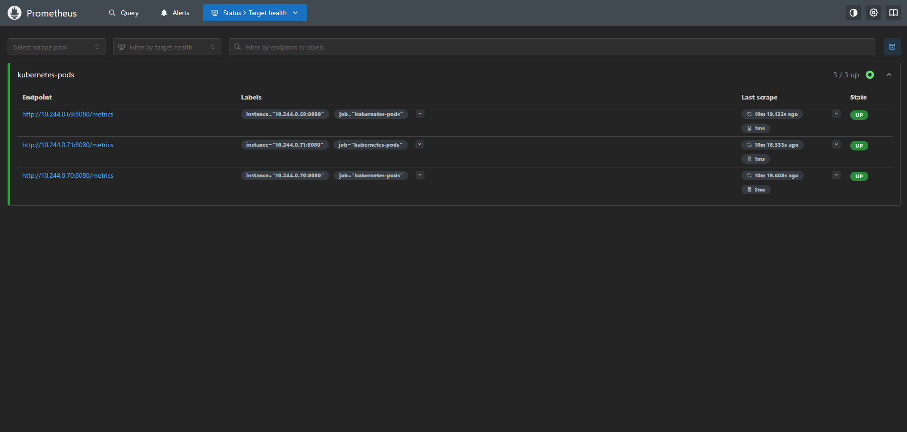
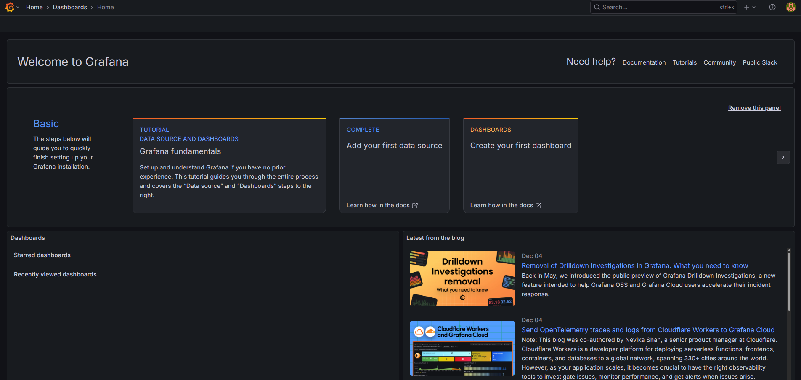
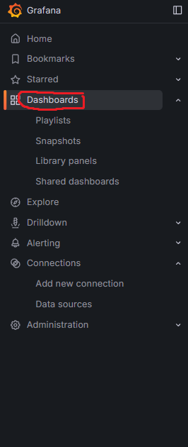
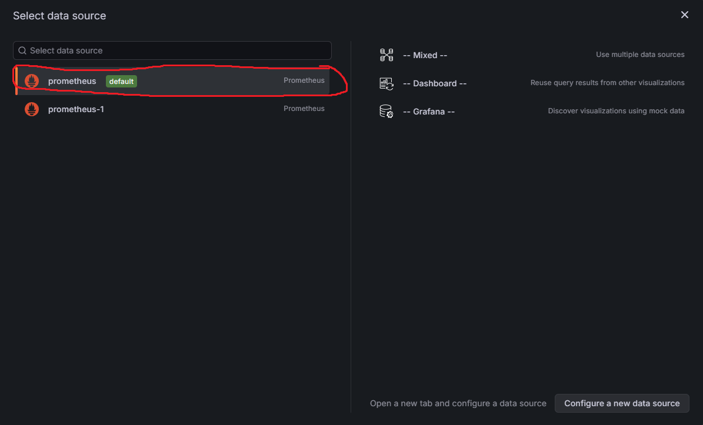
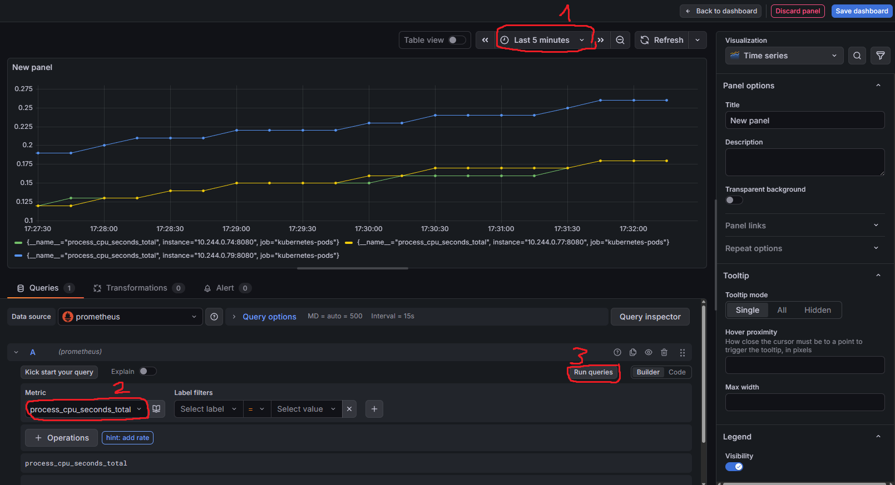

# Kubernetes & Go Monitoring
This application monitoring kubernetes pods which basic Go microservices.

# Features
* Ability to monitor system metrics with Prometheus and visualize them on Grafana

# Technologies
* Monitoring & Visualizing: Prometheus, Grafana
* Containerization & Orchestration: Docker, Kubernetes
* Backend: Go

# Requirements
* Kubernetes Cluster
* Docker

# Usage
This application has two different usage way. Kubernetes Cluster or ArgoCD can run this application. Both are explained below:

## How to run an application with Kubernetes Cluster?

1. Clone the Repository
    ```
    git clone git@github.com:xNightwielder/go-k8s-monitoring.git
    cd go-k8s-monitoring
    ```

2. Apply the Kubernetes Deployment
    ```
     kubectl apply -f k8s-deployment.yaml
    ```
    
> [!NOTE]
> This go application opened outside by Kubernetes Service type's NodePort. If you want to connect to the go application, you must learn which opened outside port this app. Use 'kubectl get services' command for which port opened app. Basic Go app working now which
> after this stage. "localhost:exposedport" for connect app.

3. Apply Horizontal Pod Autoscale for automatically updates a workload resource.

   ```
    kubectl apply -f horizontal-autoscale.yaml
   ```

> [!IMPORTANT]
> You must check kubectl top pods command. If command's output error, you must activate metrics-server on Kubernetes Cluster. Activate metric-server has different way which your using kubernetes cluster. You must search it. For example activate metric-server command on minikube cluster: minikube addons enable metrics-server

4. Apply Prometheus Deployment. You must follow these steps in order:

      ```
      cd prometheus
      kubectl apply -f prometheus-rbac.yaml
      kubectl apply -f prometheus-config.yaml
      kubectl apply -f prometheus-deployment.yaml
      kubectl apply -f prometheus-service.yaml
      ```
           
    After these steps the prometheus service will start working successfully.

5. Apply the Grafana Deployment. You must follow these steps in order:
   
      ```
      cd grafana
      kubectl apply -f grafana-deployment.yaml
      kubectl apply -f grafana-service.yaml
      ```

    Now this application run with Kubernetes Cluster.

## How to run an application with ArgoCD?

Second way of run an application is ArgoCD tool. Starting way explained to below:

1. The first step is to install the ArgoCD tool. You should install ArgoCD tool if you want to use this way.

   https://argo-cd.readthedocs.io/en/stable/getting_started/

   First step of ArgoCD installation is to create ArgoCD namespace in Kubernetes Cluster.

2. You should install ArgoCD CLI

   https://argo-cd.readthedocs.io/en/stable/cli_installation/

3. After You should do that third step of ArgoCD getting_started page. You should use Port-Forward. It connect to the API server without exposing the service.

   ```
   kubectl port-forward svc/argocd-server -n argocd 8080:443
   ```

4. You should get password for ArgoCD web interface.

   ```
    argocd admin initial-password -n argocd
   ```

   This command gives you temporary password. You can change password when you first login with this password in ArgoCD.

5. You should show below screen after login.

    
   
6. You should add this application in ArgoCD. Click Create Application button and add below information in showing panel.

   * Application Name: go-k8-monitoring
   * Project Name: default
   * Sync: Manual
   * Repository URL: https://github.com/xNightwielder/go-k8s-monitoring
   * Revision: HEAD (branches)
   * Path: k8s
   * Cluster URL: https://kubernetes.default.svc
   * Namespace: default

    And Click Create Button.

7. The screen should look like below.

   

8. After this screen you should click sync/synchronize buttons.

   

9. This screen should look like below.

    

    And now you successfully run application on ArgoCD without Prometheus and Grafana. 

## How to configure Prometheus and Grafana?

You should configure Prometheus and Grafana. Because Grafana and Prometheus not ready when application run first. You should follow these steps for configure Prometheus and Grafana.

1. Prometheus and Grafana created to be a ClusterIP Service. This reason you must do port-forwarding process for both of them. You must open two terminal and for each one following these steps:

      First Terminal:
   
   
       kubectl port-forward deployment/prometheus-deployment 9090:9090
       

      Second Terminal:
   
       
       kubectl port-forward deployment/grafana 3000:3000
       

> [!NOTE]
> These terminals musn't close for maintain access.
After these steps Prometheus and Grafana working successfully. These services accessible "localhost:9090" and "localhost:3000" addresses.

2. You must login to Grafana. Your standard username and password are admin. You should to login username: admin, password: admin in Grafana. 

    Prometheus Interface:
   
    

    Grafana Interface:
   
    

3. Now you must do Grafana settings for visualizing the Prometheus metrics. You must add Prometheus connection in Grafana. You must following these steps:
   
   * Open the Grafana Menu on the left side. Click to Connections/Add New Connections
     
      
     
   * Select Prometheus Connection
     
      
     
   * Click Add New Data Source
     
      
     
   * Add connection to Prometheus Server URL. This URL must to be http://prometheus-service:8080
     
      
     
   *  Click Save & Test on bottom of page. You must seen "Successfully queried the Prometheus API" message.
     
      
      
    After these steps you success the grafana-prometheus connection.

4. You must create dashboard for see visualized prometheus metrics.

    * Open the Grafana Menu on the left side. Click to Dashboards.
  
      

   * Click Create Dashboard/Add Visualization and select Prometheus.
  
     

   * Now you can view to metrics on visualized graphics.
  
     

Now, this application completely ready. You can monitoring go application on Kubernetes.
